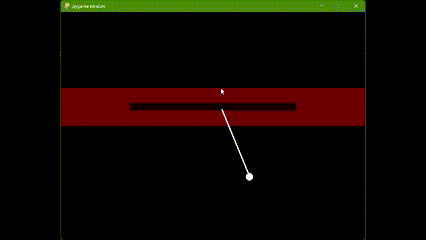

# Pendulum Simulation on Linear Cart

This project simulates a pendulum mounted on a linear cart. It provides a visual representation of the pendulum's motion and allows users to interact with the simulation.



## Dependencies

- Python 3.x
- Pygame

## Installation

1. Clone the repository:

   ```
   git clone https://github.com/your_username/pendulum-simulation.git
   ```

2. Install the required dependencies:

   ```
   pip install pygame
   ```

## How to Run

1. Navigate to the project directory:

   ```
   cd pendulum-simulation
   ```

2. Run the simulation:

   ```
   python main.py
   ```

3. Use the mouse to move the cart horizontally. Press `ESC` to exit the simulation.

## Note

This simulation is not intended to represent real-world physics accurately. It provides a simplified pendulum model on a linear cart for educational and entertainment purposes.